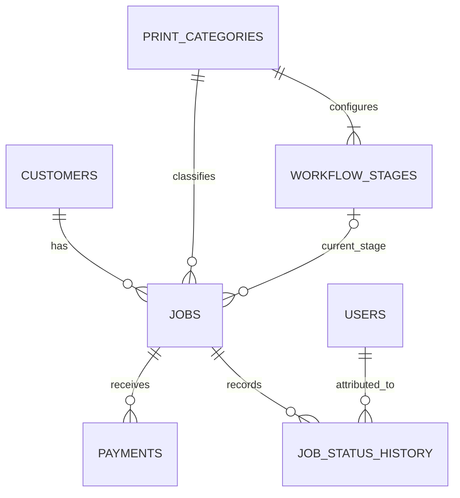

# Madweb CRM — Database Design

**Version:** 1.0  
**Status:** Proposed baseline; review before migrations

## 1. Design principles

- PostgreSQL with UUID primary keys.
- Seven core tables: `users`, `customers`, `print_categories`, `workflow_stages`, `jobs`, `payments`, `job_status_history`.
- Do not create a table for each printing category or each status.
- Use Alembic migrations.
- Use NUMERIC for money and timezone-aware timestamps.
- Prefer deactivation over deleting records referenced by jobs or history.
- Exact field lengths/defaults may be adjusted for implementation quality, but business semantics and relationships require approval to change.

## 2. `users`

Purpose: owner/Admin and staff directory, role and active status.

Proposed columns:
- `id UUID PRIMARY KEY`
- `display_name VARCHAR(150) NOT NULL`
- `username VARCHAR(100) NOT NULL UNIQUE`
- `password_hash VARCHAR(...) NOT NULL`
- `role VARCHAR(20) NOT NULL CHECK (role IN ('ADMIN', 'STAFF'))`
- `is_active BOOLEAN NOT NULL DEFAULT TRUE`
- `created_at TIMESTAMPTZ NOT NULL`
- `updated_at TIMESTAMPTZ NOT NULL`

Do not store plaintext passwords. Do not expose `password_hash` in API responses. A secure initial Admin must be provisioned through a documented process. Do not hardcode credentials.

The dropdown displays active users. User deactivation must not delete their historical attribution.

## 3. `customers`

Proposed columns:
- `id UUID PRIMARY KEY`
- `name VARCHAR(200) NOT NULL`
- `phone VARCHAR(40) NOT NULL`
- `business_name VARCHAR(200) NULL`
- `address TEXT NULL`
- `notes TEXT NULL`
- `is_active BOOLEAN NOT NULL DEFAULT TRUE`
- `created_at TIMESTAMPTZ NOT NULL`
- `updated_at TIMESTAMPTZ NOT NULL`

Phone is text, not numeric. Do not require phone to be globally unique unless the business explicitly approves it; family/business contacts may share a number. Index normalized/searchable phone and name as appropriate. One customer may have many jobs.

## 4. `print_categories`

Proposed columns:
- `id UUID PRIMARY KEY`
- `name VARCHAR(120) NOT NULL`
- `description TEXT NULL`
- `is_active BOOLEAN NOT NULL DEFAULT TRUE`
- `created_at TIMESTAMPTZ NOT NULL`
- `updated_at TIMESTAMPTZ NOT NULL`

Avoid duplicate active category names using an appropriate uniqueness rule. Deactivated categories referenced by jobs must remain available to historical records.

## 5. `workflow_stages`

Proposed columns:
- `id UUID PRIMARY KEY`
- `category_id UUID NOT NULL REFERENCES print_categories(id)`
- `name VARCHAR(120) NOT NULL`
- `sequence INTEGER NOT NULL CHECK (sequence > 0)`
- `is_initial BOOLEAN NOT NULL DEFAULT FALSE`
- `is_final BOOLEAN NOT NULL DEFAULT FALSE`
- `is_active BOOLEAN NOT NULL DEFAULT TRUE`
- `created_at TIMESTAMPTZ NOT NULL`
- `updated_at TIMESTAMPTZ NOT NULL`

Require a unique sequence per category and prevent duplicate stage names within a category where appropriate. The application must validate that each active workflow has exactly one active initial stage and one active final stage. Cross-row rules may need application/service validation or a carefully designed database mechanism.

A referenced stage must not be hard-deleted. Deactivate it instead. Reordering must avoid sequence collisions during updates.

## 6. `jobs`

Proposed columns:
- `id UUID PRIMARY KEY`
- `job_number VARCHAR(40) NOT NULL UNIQUE`
- `customer_id UUID NOT NULL REFERENCES customers(id)`
- `category_id UUID NOT NULL REFERENCES print_categories(id)`
- `title VARCHAR(200) NOT NULL`
- `description TEXT NOT NULL`
- `quantity INTEGER NOT NULL CHECK (quantity > 0)`
- `specifications JSONB NOT NULL DEFAULT '{}'`
- `lead_status VARCHAR(32) NOT NULL`
- `current_stage_id UUID NULL REFERENCES workflow_stages(id)`
- `quoted_amount NUMERIC(12,2) NULL CHECK (quoted_amount >= 0)`
- `final_amount NUMERIC(12,2) NULL CHECK (final_amount >= 0)`
- `advance_amount NUMERIC(12,2) NOT NULL DEFAULT 0 CHECK (advance_amount >= 0)`
- `due_date TIMESTAMPTZ NULL`
- `next_follow_up_at TIMESTAMPTZ NULL`
- `notes TEXT NULL`
- `created_at TIMESTAMPTZ NOT NULL`
- `updated_at TIMESTAMPTZ NOT NULL`

The proposed lifecycle values are:
`NEW_INQUIRY`, `QUOTATION_PREPARED`, `AWAITING_CONFIRMATION`, `CONFIRMED`, `LOST`, `CANCELLED`.

The API/service layer must enforce allowed transitions. A confirmed job must have a valid initial/current production stage according to the approved transition policy. A job's `current_stage_id` must reference a stage belonging to its `category_id`; enforce this at service level and use stronger database constraints if practical.

`specifications` holds category-specific JSON fields such as dimensions, material, finish, colors, sides and mounting details. Common fields remain regular columns.

Clarify whether a job number is sequential/human-readable or generated with a safe unique scheme. Do not use a race-prone `MAX(job_number) + 1` implementation.

## 7. `payments`

Proposed columns:
- `id UUID PRIMARY KEY`
- `job_id UUID NOT NULL REFERENCES jobs(id)`
- `amount NUMERIC(12,2) NOT NULL CHECK (amount > 0)`
- `payment_method VARCHAR(40) NOT NULL`
- `reference_number VARCHAR(160) NULL`
- `paid_at TIMESTAMPTZ NOT NULL`
- `notes TEXT NULL`
- `created_at TIMESTAMPTZ NOT NULL`

Payment methods should support at least cash, UPI and bank transfer; decide whether values are an enum or validated strings based on the API contract. Multiple payments per job are expected.

Total paid is the sum of valid payment records. Outstanding balance is `final_amount - total_paid`. Payment status is derived:
- `UNPAID` when total paid is zero.
- `PARTIALLY_PAID` when total paid is greater than zero and less than the amount due.
- `PAID` when total paid equals the amount due.

Before implementing overpayment, refunds, voiding or payment corrections, ask for policy decisions. Do not silently permit negative outstanding balances or mutate payment history without an approved correction model.

## 8. `job_status_history`

Proposed columns:
- `id UUID PRIMARY KEY`
- `job_id UUID NOT NULL REFERENCES jobs(id)`
- `from_stage_id UUID NULL REFERENCES workflow_stages(id)`
- `to_stage_id UUID NOT NULL REFERENCES workflow_stages(id)`
- `updated_by_user_id UUID NOT NULL REFERENCES users(id)`
- `notes TEXT NULL`
- `created_at TIMESTAMPTZ NOT NULL`

The `updated_by_user_id` is the selected attribution person, not necessarily the authenticated operator. Validate that the selected user exists and is active when the update is made. Preserve this reference if that user is later deactivated.

The first production-stage assignment may have a null `from_stage_id`. History is append-only for normal operations. Current-stage update and history insert must happen in one transaction.

## 9. Relationships

- `customers 1 ── many jobs`
- `print_categories 1 ── many jobs`
- `print_categories 1 ── many workflow_stages`
- `workflow_stages 1 ── many jobs` through current stage
- `jobs 1 ── many payments`
- `jobs 1 ── many job_status_history`
- `users 1 ── many job_status_history` through selected attribution user

## 10. Indexes

At minimum, evaluate indexes for:
- Foreign keys and commonly joined identifiers.
- `jobs.job_number` (unique).
- `jobs.customer_id`, `jobs.category_id`, `jobs.lead_status`, `jobs.current_stage_id`.
- `jobs.next_follow_up_at`, `jobs.due_date`, `jobs.created_at`.
- `workflow_stages(category_id, sequence)`.
- `payments(job_id, paid_at)`.
- `job_status_history(job_id, created_at)`.
- Customer name/phone search, using appropriate PostgreSQL indexing for the chosen search behavior.

Avoid adding indexes without considering query patterns and write costs.

## 11. Deletion and history policy

- Prefer `is_active = false` for users, categories and workflow stages that have historical references.
- Do not cascade-delete payment or status history when a job is deleted.
- Jobs with history or payments should normally be cancelled/archived rather than hard-deleted.
- Define deletion restrictions and return clear API errors.
- Stage deactivation must not break historical displays. For jobs currently on a deactivated stage, do not silently rewrite history; require a deliberate valid transition or a documented migration of current state.

## 12. Transaction and concurrency requirements

- Update job stage and insert history atomically.
- Use row locking or optimistic concurrency/version checks to prevent simultaneous updates silently overwriting each other.
- Validate category/stage compatibility inside the transaction.
- Payment creation must not be double-counted on retries. Add idempotency only with a documented API design.
- Generate job numbers without race conditions.

## 13. Mermaid ER diagram

## 14. Migration plan

1. Create the initial migration for all seven core tables and indexes.
2. Review generated migration SQL before applying it.
3. Test migration from an empty database.
4. Test upgrade against a disposable database containing representative records.
5. Never edit an applied migration; create a new migration for later changes.
6. Never automatically reset a developer's or production database.

## 15. Decisions requiring confirmation before affected code

Ask for clarification if not specified elsewhere:
- Authentication/session design for the shared system and Admin-only staff creation.
- Job number format.
- Whether final amount can change after payments exist and how corrections are audited.
- Overpayment/refund/void policy.
- Exact rules when a workflow stage is deactivated while jobs reference it.
- Whether jobs can be reopened after `LOST`, `CANCELLED` or `CONFIRMED`.

## 16. Phase 2 implementation notes

These notes record how the approved schema is enforced. They do not change business rules.

### Database-level enforcement

- Foreign keys use `ON DELETE RESTRICT` so users, categories, stages, jobs, payments and history cannot be removed in a way that silently destroys related records.
- Payments and job status history are not cascade-deleted.
- Active print category names are unique (`uq_print_categories_active_name`).
- Active stage names are unique per category.
- Stage sequence is unique per category. The constraint is deferrable so reordering can be done in one transaction without collisions.
- At most one active initial stage and one active final stage per category are enforced with partial unique indexes.
- A job's `current_stage_id`, when set, must belong to the job's `category_id` via composite foreign key `fk_jobs_current_stage_same_category`.
- Check constraints enforce user roles, lead statuses, positive quantity/sequence/payment amount, and non-negative money columns.
- `password_hash` is `VARCHAR(255)`.
- Payment methods are stored as `VARCHAR(40)` rather than a closed database enum, so additional configured methods do not require a schema change.

### Service-layer enforcement (later phases)

The following cannot be fully enforced by this schema and must be validated by the service layer:

- Each active workflow must have **exactly** one active initial stage and one active final stage (the database enforces at most one).
- The selected attribution user must exist and be **active** at the time of a stage change. History keeps the user ID if that user is later deactivated.
- Job stage updates and history inserts must commit or roll back together.
- Attribution identity must not be used for authorization.
- Allowed inquiry lifecycle transitions.
- Job-number generation without `MAX(job_number) + 1`.
- Concurrent stage updates (expected current stage or equivalent). A version column was not added because it is not in the approved schema.
- Payment-method allow-list, overpayment/refund policy, and idempotency.
